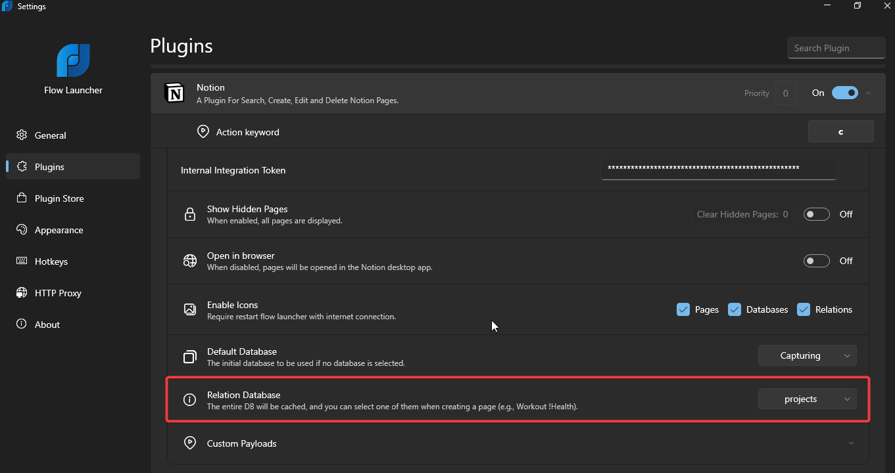

# Professional Setup Instructions

## Installation Process

1. **Plugin Installation:**
   - Start by installing the plugin.

2. **Plugin Activation:**
   - Trigger the plugin using the action keyword `c`.
   - Click to open the settings panel.

   > 

### Configuration Steps

3. **Navigate to Settings:**
   - Within the settings, navigate to `Settings > Plugins > Notion`.

4. **Integration Token Setup:**
   - Paste your Internal Integration Token.
   - [Create a new token](https://www.notion.so/my-integrations) if necessary.

   > **Notes:**
   > - Ensure that the Internal Integration Token Content Capabilities include Read, Update, and Insert content.
   >   
   >     
   >
   > - Share at least one database with the token.
   >    - To share a database, go to the Database page and select your integration name.
   >      
   >     

5. **Database Query:**
   - Trigger the plugin again after setting the Internal Integration Token.
   - Wait while the plugin queries the databases.

6. **Testing Databases:**
   - Test the databases using the command `c @`.
    
     

   - Confirm that your databases shared with the token are visible.

8. **Select Relation Database:**
   - Navigate to `Settings > Plugins > Notion`.
   - Choose your relational database and await the success message.

   > 

9. Finally restart Flow Launcher.

These comprehensive setup instructions ensure a seamless integration process for optimal performance and functionality. If images are not loading, please check your internet connection or access the images directly in the provided file paths.
