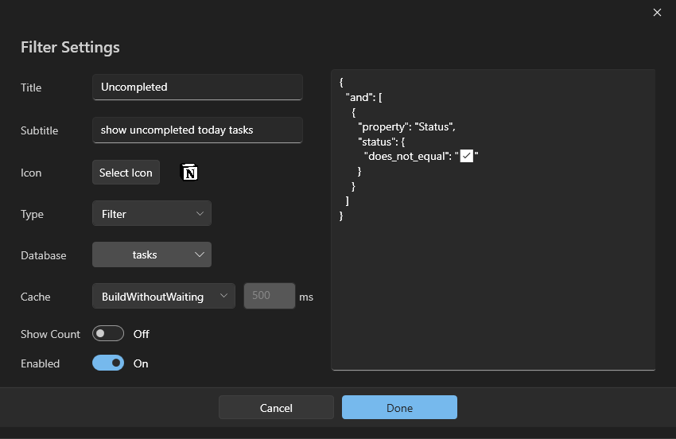

# Flow launcher Plugin Notion


- [Features](#features)
- [Commands](#commands)
- [Demos](#demos)
- [Installation Process](#installation-process)
- [Command Reference](#command-reference)
- [Custom Payload](#custom-payload)
- [Licence](#licence)

# Features

- High-Speed Interface
- Efficient search (without latency) and quick access to Notion items (pages, database and relations)
- Hide and Unhide pages from query
- Support for databases, multi selections, relations, links and date properties
- Quick create database items with custom supported properties
- Optional icons for Notion items, with the flexibility to disable them
- Support for custom payload to search or Edit
- Open-source for transparency
- All data is cached and stored locally for optimal performance
- Prioritizing user privacy and security

# Commands

- `@` To select database
- `!` To select relation
- `#` To select Tag (multi select only) support multiple tags
- `[` To add a link
- `*` or `^` To insert a block
- `$` Used by auto complete `Tab Key` to change mode to search filter when auto complete a database or relation
- `$` Used by auto complete `Tab Key` to change mode to Edit when auto complete a database item
- Date is automatically selected once it is recognized.

## Installation Process
1. **Plugin Installation:**
   - Start by installing the plugin.
     In flow launcher query paste
     
     ```
     pm install notion by Amin Salah
     ```

2. **Plugin Activation:**
   - Trigger the plugin using the action keyword `c`.
   - Click to open the settings panel.

     

### Configuration Steps

   

3. **Navigate to Settings:**
   - Within the settings, navigate to `Plugins > Notion`.

4. **Integration Token Setup:**
   - Paste your Internal Integration Token.
   - [Create a new token](https://www.notion.so/my-integrations) if necessary.

   
      > **Note:**  
      > - Ensure that the Internal Integration Token Content Capabilities include Read, Update, and Insert content.
      >   
      >     
      >
      > - Share at least one database with the token.
      >    - To share a database, go to the Database page and select your integration name.
      >      
      >     

5. **Database Query:**
   - Trigger the plugin again after setting the Internal Integration Token.
   - Wait while the plugin queries the databases.

6. **Testing Databases:**
   - Test the databases using the command `c @`.
    
     

   - Confirm that your databases shared with the token are visible.

8. **Select Relation Database:**
   - Navigate to `Settings > Plugins > Notion`.
   - Choose your relational database and await the success message.

    

9. Finally, restart Flow Launcher.
10. After Flow Launcher opens, if the search cache is provided properly (require internet connection), you will see all shared pages with your token. The create mode is only allowed when there is no match with the query and shared pages.
    
    > In case of any error Relod Plugins data or Restart flow lunacher with good internet connection to build a cache.


> **Note:**
> 
> To enhance the visual appeal and facilitate the display of SVG icons in Flow Launcher, I recommend installing the SVG Explorer Extension for SVG preview. You can find the extension [here](https://github.com/tibold/svg-explorer-extension/releases).

# Demos

#### `Create` a new database item with relation.


#### `Search`, `Open` and `Edit` existing page.


#### `Append` blocks for an existing page or a new page.


#### `Delate` and `Complete` existing page (Plugin comes with two custom payload (delete and complete)).


# Command Reference

- [Keywords](#keywords)
- [Context Menu](#context-menu-of-pages)
- [Escape Plugin Keywords](#how-to-escape-plugin-keywords)
- [Key Modifiers and Shortcuts](#key-modifier-and-shortcuts)


  ## Keywords

   - [c + no input](#c--no-input)
   - [c + word](#c--word)
   - [c + @](#c--)
   - [c + !](#c--)
   - [c + page details + #](#c--page-details--)
   - [c + page details + * or ^](#c--page-details--*or^)
   - [c + page details + Humanized time](#c--page-details--humanized-time)
  
  ## `c + no input`
  Trigger the plugin with an empty query to activate search mode. List of results would contain all shared pages with your integration
  ***Tip:*** Press Arrow Up to display recently added or edited pages.

  ## `c + word`
  Initiate a search for the specified word within page titles. Navigate through the pages using the following commands:
   - Press `Enter` or use `Mouse Down` to open the page in your browser (default and configurable).
   - Press `Shift + Enter` or use `Left Arrow` to reveal the [Context menu for pages](#context-menu-for-pages).
 
  ## `c + @`
     Show shared databases with your integration. You can perform the following actions:
     - Select a database to create a page within by pressing `Enter` or use `Mouse Down`
     - Open the database page in Notion by pressing `Ctrl + Enter` or `Ctrl + Mouse Down`
     - Quickly set the database as default database by pressing `Alt + Enter` or `Alt + Mouse Down`
       

    ## `c + !`
     Show selected relation database pages if it's selected in settings panel. You can perform the following actions:
     - Select a page to link a created page to it by pressing `Enter` or use `Mouse Down`
     - Open the page in Notion by pressing `Ctrl + Enter` or `Ctrl + Mouse Down`

    ## `c + page details + #`
   
   If the database has more than one multi-selection property, the result list would contain names of these properties to choose from. In the case where the database has only one multi-select property, the plugin would automatically choose it and display all available tags (non-clickable). You can choose options by using `# + optionName`:
   

   
   
   ## `c + page details + * or ^`
   
   **After assigning a block type keyword, it is not possible to select database, relations, tags, or date options.**

   **What is the difference between `*` and `^`?**
   - `*` will show you supported block types for you to choose from before entering the desired block text.
   - `^` will skip the previous step and automatically choose the default block type, which is `paragraph`.
   
   **Is the default block type configurable?**
   - Yes, it is. Hold the ctrl key before choosing the block type, and it will set the selected block type as default. However, it will revert to the paragraph if the query is cleared.
   
   
   
   In case the selected block type requires more arguments, such as specifying the language for a code block, there is a next step where the result list will display Notion options to choose from.
   
   ***Tip:*** To paste the clipboard content as it was copied, utilize `Alt + Enter`. This is recommended because the `ctrl + v` process may alter the content and remove multiple lines.
   
   
     


  ### BlockType Mode Limitations
   Notion supports only a [Limited number of characters](https://developers.notion.com/reference/request-limits#limits-for-property-values) for each block type. If the character limit is exceeded, you will receive a **Bad Request** error.
   

    ## `c + page details + Humanized time`
    The plugin recognizes humanized time, eliminating the need to input it in a specific format.

     
  

## Context menu of pages

> Under construction


## How to escape plugin keywords?

To escape any keyword simply add backslah before it `\` 

**Supported keywords:**

1. `@`
2. `!`
3. `#`
4. Custom Filter titles
5. Dates by choosing cancel after they are recognized or backslah.


**Unsupported Keywords:**

1. `*`
2. `^`
3. `$`


## Key Modifiers and Shortcuts

> Under construction


# Custom Payload

### Description
> :memo: Utilizing custom payloads allows you to:
> - Query specific filters such as (All uncompleted tasks and overdue).
> - Edit specific tasks based on payload from the context menu (Shift + Enter), for example, `change state to complete and set complete date to now`.

> **Note:**
>   The plugin comes with two payloads:
>   1. **Complete** Payload needs to be configured to match your database property names.
>   2. **Delete** Payload does not need configuration.
>  
### How to Add a New Custom Payload as a `filter`


1. Navigate to `Settings > Plugins > Notion > Custom Payload`.
2. Click the Add Button.
3. Set a title (required) and subtitle (optional) for the filter.

   > Titles cannot be duplicated.
   
5. Keep the type as a filter.
6. Choose the database to query (required).
7. Select the cache type based on your needs.

    - **Disabled**: Pages will not be cached, and search will be in real-time.
    - **BuildAndWait**: Initiates API call when the flow becomes visible, and if the filter is triggered while the API has not responded yet, it will wait for the response.
    - **BuildWithoutWaiting**: Similar to the previous option, but if the filter is triggered and the API has not responded yet, it will display old cached pages until new data is received.
    - **BuildWithTimeout**: Like the previous option, with the added feature of setting a timeout for the API. If the API exceeds the specified timeout, it will display old cache.
8. Create a new payload `JSON` (if left empty, the entire database will be queried) or use this filter.
   > For more information about how you can create more advanced filters, navigate to [notion](https://developers.notion.com/reference/post-database-query-filter#the-filter-object).
```
{
 "and": [
      {
        "property": "Due",
        "date": {
          "on_or_before": "{{current date}}"
        }
      },
      {
        "or": [
          {
            "property": "Status",
            "status": {
              "equals": "🍵"
            }
          },
          {
            "property": "Status",
            "status": {
              "equals": "🔄"
            }
          }
        ]
      }
    ]
}
```
- This filter represents this on the Notion UI
  
 

8. Click the Add button and trigger the plugin; you should see the advanced filter or search for it by title.
   
### How to Add a New Custom Payload as a `property`

- Similar to a filter, but the key difference is that
     1. Property payloads query in the context menu (Shift + Enter {or right arrow}) on the page in the query.
     2. Property payloads JSON differs from Filter payloads.
     3. It is possible to select multiple databases. If a page does not belong to the payload databases, the custom payload will not appear on its context menu.
           
- Paste your own Payload (JSON) or edit these to match your needs.
     ```
   {
     "properties": {
       "Status": {
         "status": {
           "name": "✅"
         }
       }
     }
   }

     ```

     > This JSON will set the property name "Status" of type "status" into the option "✅".
     You can also combine more than one property.
     ```
   {
     "properties": {
       "Status": {
         "status": {
           "name": "✅"
         }
       },
       "Latest Review": {
         "date": {
           "start": "{{current date}}",
          
         }
       }
     }
   }

     ```
     > This JSON will do the same as before, setting the start date of the latest review to the current date.
     
### JSON Variables as `current date` 

Right now, the plugin only supports converting to dates.
- To add a date variable, set the variable within two curly brackets; only use spaces to separate words, like `{{current date}}`.
- To check if your variable is supported, try typing it in the query; if it gives a result, this means it's supported.

  
  
> UNDER CONSTRUCTION


# Say Thank You
If you are enjoying Notion Plugin, then please support my work and enthusiasm by buying me a coffee on [https://ko-fi.com/amin_salah](https://ko-fi.com/amin_salah)

[](https://ko-fi.com/K3K5OBFG2)

Please also help spread the word by sharing about the Flow launcher Notion Plugin on Twitter, Reddit, or any other social media platform you regularly use.

# Licence
The source code for this plugin is licensed under MIT.
